# Experiment 1 — ETL Concurrency Scaling (Integration Load Test)
**CS6650 Final Project — ETL Component**
*Last updated: 2026-04-03*

> **Note:** External API calls (OCR, LLM, geocoding) are replaced with calibrated blocking stubs. This test evaluates the ETL service's concurrency model, thread pool behaviour, and queueing dynamics under realistic load — it does not include real provider rate limits, network variability, or API cost. See `tests/start_integration.py` for stub implementation details.

---

## Question

As concurrent requests increase, does throughput scale linearly — or does the system serialize?

## Concept

The ETL pipeline makes blocking network calls (OCR ~5s, LLM ~3.7s, geocoding ~0.5s) inside an async FastAPI service. FastAPI offloads these blocking calls to a thread pool. As concurrent users increase, the thread pool saturates before the provider rate limits do — causing requests to queue and P99 latency to spike.

This experiment finds:
1. At what user count does the thread pool saturate (RPS plateaus)?
2. Does adding uvicorn workers (`--workers W`) push the ceiling up linearly?

---

## Setup

**Integration test server** (`tests/start_integration.py`):
- Full FastAPI + uvicorn service with real `etl.py` code path
- External provider calls replaced with calibrated blocking stubs:
  - OCR: CPU work + `sleep(4.7s)` — ADI cap enforced via `threading.Semaphore(15)`
  - LLM: CPU work + `sleep(3.5s)`
  - Upload: no-op
- Total mock pipeline latency: ~8.2s P50

**Load generator** (`tests/locustfile_integration.py`):
- `constant_throughput(1)` — 1 req/s target per user
- Each user sends `POST /etl` with a local receipt path
- Spawned at ramp rate `-r N/5` users/sec

**Sweep:**
- Users: **10 → 50 → 100 → 200**
- Uvicorn workers: **W = 1, 2, 4**
- Run time: 60s per configuration

---

## Results

### W = 1 uvicorn worker

| Users | RPS | P50 (ms) | P95 (ms) | P99 (ms) | Avg (ms) | Failures |
|------:|----:|---------:|---------:|---------:|---------:|---------:|
| 10    | 1   | 8,300    | 8,400    | 8,400    | 8,319    | 0        |
| 50    | 1.9 | 21,000   | 23,000   | 23,000   | 19,054   | 0        |
| 100   | 1.7 | 30,000   | 44,000   | 45,000   | 29,255   | 0        |
| 200   | 2.4 | 34,000   | 57,000   | 59,000   | 33,837   | 0        |

### W = 2 uvicorn workers

| Users | RPS | P50 (ms) | P95 (ms) | P99 (ms) | Avg (ms) | Failures |
|------:|----:|---------:|---------:|---------:|---------:|---------:|
| 10    | 1.4 | 8,227    | 8,300    | 8,300    | 8,242    | 0        |
| 50    | 5.0 | 8,300    | 14,000   | 14,000   | 10,205   | 0        |
| 100   | 4.4 | 16,000   | 27,000   | 28,000   | 17,849   | 0        |
| 200   | 5.0 | 27,000   | 44,000   | 45,000   | 27,190   | 0        |

### W = 4 uvicorn workers

| Users | RPS | P50 (ms) | P95 (ms) | P99 (ms) | Avg (ms) | Failures |
|------:|----:|---------:|---------:|---------:|---------:|---------:|
| 10    | 1.3 | 8,300    | 8,300    | 8,400    | 8,254    | 0        |
| 50    | 6.0 | 8,300    | 8,400    | 8,900    | 8,296    | 0        |
| 100   | 10.4 | 10,000  | 13,000   | 13,000   | 9,965    | 0        |
| 200   | 9.8 | 20,000   | 25,000   | 27,000   | 17,975   | 0        |

---

## Observations So Far

### u=10, W=1 (completed)

- **RPS = 1** — expected. Each request takes ~8.3s; with `constant_throughput(1)` each user achieves 1/8.3 ≈ 0.12 req/s. 10 users × 0.12 = **~1.2 RPS**.
- **P95 ≈ P99 ≈ Median (8,300–8,400ms)** — near-zero variance. No queueing. Every request received a thread immediately.
- **0 failures** — system healthy at low load.
- **Interpretation:** At 10 concurrent users with 1 worker, the thread pool is nowhere near saturation. This is the clean baseline — pipeline latency is the only ceiling, not contention.

### u=50, W=1 (completed)

- **RPS = 1.9** — expected if unconstrained: 50 × 0.12 = 6 RPS. Actual is only 1.9 — thread pool is the ceiling, not user count.
- **Median jumped from 8,300ms → 21,000ms** — the extra ~12,700ms is queueing delay. Requests wait for a thread before processing even starts.
- **Min = 8,395ms (unchanged)** — lucky requests that arrive when a thread is free still see baseline latency. Queue is not permanent yet.
- **P95 ≈ P99 = 23,000ms** — consistent queue depth, no wild tail outliers.
- **Interpretation:** The bottleneck shifted between u=10 and u=50. Thread pool saturation is the new ceiling. This is the finding — pipeline duration was the limit at low load; queueing is the limit at moderate load.

---

## Observations So Far (W=2)

### u=10, W=2 (completed)

- **RPS = 1.4** — matches W=1 at u=10 (~1.0–1.2). No meaningful difference; both workers are idle at this load.
- **P50 = 8,227ms, P99 = 8,300ms** — near-baseline, near-zero variance. No queueing.
- **Interpretation:** At u=10, the second worker adds no observable benefit. Load is too low to stress even a single worker's thread pool. Identical to W=1 baseline behavior.

### u=50, W=2 (completed)

- **RPS = 5.0** — vs 1.9 for W=1 at the same user count. More than 2.6× throughput with 2× workers — both workers are active and splitting load.
- **P50 = 8,300ms** — held at baseline. W=2 is NOT saturated at u=50. Most requests get a thread immediately with no queueing delay at the median.
- **P99 = 14,000ms** — only the tail is seeing queueing (~5,700ms), vs W=1 where the *median* was already 12,700ms deep in the queue.
- **Interpretation:** W=1 was clearly saturated at u=50 (median 21,000ms, RPS capped at 1.9). W=2 at u=50 shows the saturation point has shifted right — the combined thread pool has enough capacity to absorb this load. This is the finding: each additional worker carries its own thread pool, pushing the ceiling up.

### u=100, W=2 (completed)

- **RPS = 4.4** — dropped from 4.9 at u=50. Saturation has kicked in between u=50 and u=100, same pattern as W=1 saturating between u=10 and u=50.
- **P50 = 16,000ms** — queueing delay appeared at the median (~7,700ms above baseline). W=2 is now saturated.
- **P99 = 28,000ms** — tail is growing; back-of-queue requests wait nearly 20s beyond baseline before getting a thread.
- **Same 268 completed requests as u=50** — throughput has plateaued; extra users only lengthen the queue, they cannot increase RPS.
- **Min = 8,240ms** — a small fraction of requests still get immediate service; queue is not yet permanent.
- **Interpretation:** W=2 saturation point falls between u=50 and u=100. This mirrors W=1's saturation between u=10 and u=50 — the ceiling shifted right by roughly one user-count tier, consistent with doubling the thread pool capacity.

### u=200, W=2 (completed)

- **RPS = 5.0** — flat vs u=100 (4.4). Plateau confirmed: adding users beyond the saturation point does not increase throughput.
- **P50 = 27,000ms** — queueing delay of ~18,700ms at the median. Severe saturation.
- **P99 = 45,000ms** — matches W=1's P99 at u=100 exactly. The tail latency ceiling shifted by one full user tier.
- **Min = 8,266ms** — a small fraction of requests still get immediate service throughout.
- **W=2 sweep complete:** RPS plateaued at ~4.4–5.0 regardless of user count above u=100. Ceiling is ~2× W=1's plateau (~1.7–2.4 RPS) — consistent with 2× thread pool capacity from 2× workers.

---

## Observations So Far (W=4)

### u=10, W=4 (completed)

- **RPS = 1.3** — matches W=1 and W=2 at u=10. No meaningful difference across worker counts at this load.
- **P50 = 8,300ms, P99 = 8,400ms** — at baseline, near-zero variance. No queueing.
- **Interpretation:** At u=10, all three worker configurations behave identically. Load is too low to stress even a single thread pool. Extra workers are idle.

### u=50, W=4 (completed)

- **RPS = 6.0** — highest throughput seen at u=50 across all worker counts (vs 1.9 for W=1, 5.0 for W=2).
- **P50 = 8,300ms** — at baseline. No queueing at the median.
- **P99 = 8,900ms** — only 600ms above baseline. Near-zero queueing even at the tail. W=4 has far more headroom than W=2 (P99=14,000ms) at the same load.
- **335 completed requests** — vs 243 (W=2) and 175 (W=1).
- **Interpretation:** W=4 is clearly not saturated at u=50. The combined thread pool across 4 workers absorbs the load with almost no queueing anywhere in the distribution. Saturation point has shifted significantly right compared to W=1 and W=2.

### u=100, W=4 (completed)

- **RPS = 10.4** — more than 2× W=2's 4.4 RPS at the same user count. Roughly linear scaling with worker count.
- **P50 = 10,000ms** — only ~1,700ms above baseline. W=4 is not saturated at u=100; most requests still get a thread almost immediately.
- **P99 = 13,000ms** — same tail queueing W=2 showed at u=50, not u=100. The saturation front has shifted right by one full user tier.
- **525 completed requests** — vs 268 (W=2) and 140 (W=1) at the same load.
- **Interpretation:** Pattern holds — each doubling of workers shifts the saturation point right by one user tier. W=4 at u=100 looks like W=2 at u=50 and W=1 at u=10. Saturation expected between u=100 and u=200.

### u=200, W=4 (completed)

- **RPS = 9.8** — flat vs u=100 (10.1). Plateau confirmed.
- **P50 = 20,000ms** — queueing delay jumped to ~11,700ms at the median. Saturation has set in between u=100 and u=200.
- **P99 = 27,000ms** — vs 45,000ms (W=2) and 59,000ms (W=1) at u=200. More workers compress the tail; the worst-case experience improves with each added worker even at saturation.
- **W=4 sweep complete:** RPS plateaued at ~9.8–10.1. Near-linear scaling confirmed — W=2 ≈ 2× W=1, W=4 ≈ 2× W=2. Each worker brings its own independent thread pool; the throughput ceiling scales linearly with worker count.

---

## Progression So Far (W=1)

| Users | RPS | Median (ms) | P99 (ms) | Queueing Delay | Bottleneck |
|------:|----:|------------:|---------:|---------------|---|
| 10    | 1.0 | 8,300       | 8,400    | ~0ms          | Pipeline duration |
| 50    | 1.9 | 21,000      | 23,000   | ~12,700ms     | Thread pool queue |
| 100   | 1.7 | 30,000      | 45,000   | ~21,700ms     | Thread pool — severe queueing |
| 200   | 2.4 | 34,000      | 59,000   | ~25,700ms     | Thread pool — absolute ceiling |

*Queueing delay = Median − 8,300ms baseline*

**Key shift between u=10 and u=50:**
- RPS increased only 1.9× despite 5× more users — thread pool is the ceiling, not user count
- Median latency 2.5× higher — ~12,700ms spent waiting for a thread before processing begins
- Min latency unchanged (~8,395ms) — lucky requests still see baseline when a thread is free
- Bottleneck migrated from pipeline duration → thread pool saturation

**u=100 — past saturation:**
- RPS dropped from 1.9 → 1.7 — doubling users made throughput slightly *worse*; queue overhead grows
- P99 exploded: 23,000ms → 45,000ms — tail latency is super-linear; back-of-queue requests wait ~37s before a thread is free
- P95/P99 divergence appeared — at u=50, P95≈P99 (tight queue); at u=100, P99 is 45,000ms vs median 30,000ms
- Only 140 completed requests vs 175 at u=50 — queue so long that requests started after ~t=30s don't finish within the 60s window
- Min unchanged (~8,393ms) — a small fraction of requests still get immediate service

**u=200 — absolute ceiling confirmed:**
- Same 140 completed requests as u=100 — doubling users (100→200) had zero effect on throughput
- Thread pool ceiling is absolute: extra users only lengthen the queue, they cannot increase RPS
- P99: 45,000ms → 59,000ms — tail requests wait nearly the full 60s run window before getting a thread
- Max = 59,238ms — some requests barely completed before Locust stopped; many more were still in-flight uncounted
- W=1 sweep complete: RPS plateaued at ~1.7–2.4 regardless of user count above ~50

---

## Progression So Far (W=2)

| Users | RPS | Median (ms) | P99 (ms) | Queueing Delay | Bottleneck |
|------:|----:|------------:|---------:|----------------|---|
| 10    | 1.4 | 8,227       | 8,300    | ~0ms           | Pipeline duration |
| 50    | 5.0 | 8,300       | 14,000   | ~5,700ms tail  | Thread pool — light tail queueing |
| 100   | 4.4 | 16,000      | 28,000   | ~7,700ms       | Thread pool queue |
| 200   | 5.0 | 27,000      | 45,000   | ~18,700ms      | Thread pool — absolute ceiling |

*Queueing delay = Median − 8,300ms baseline*

**Key findings (W=2):**
- Saturation point shifted from u=10→50 (W=1) to u=50→100 (W=2) — ceiling moved right by one user tier
- RPS plateau ~4.4–5.0, roughly 2× W=1's plateau (~1.7–2.4) — consistent with 2× thread pool capacity
- At u=200, P99=45,000ms matches W=1's P99 at u=100 — severity of tail latency shifted by one tier

---

## Progression So Far (W=4)

| Users | RPS | Median (ms) | P99 (ms) | Queueing Delay | Bottleneck |
|------:|----:|------------:|---------:|----------------|---|
| 10    | 1.3 | 8,300       | 8,400    | ~0ms           | Pipeline duration |
| 50    | 6.0 | 8,300       | 8,900    | ~600ms tail    | Pipeline duration — barely any queueing |
| 100   | 10.4 | 10,000     | 13,000   | ~1,700ms       | Pipeline duration — light tail queueing |
| 200   | 9.8  | 20,000     | 25,000   | ~11,700ms      | Thread pool — saturated |

*Queueing delay = Median − 8,300ms baseline*

**Key findings (W=4):**
- RPS plateau: ~9.8–10.1 — roughly 2× W=2's plateau (~4.4–5.0) and ~4× W=1's (~1.7–2.4). Near-linear scaling with worker count.
- Saturation point fell between u=100 and u=200 — one full tier right of W=2 (u=50→u=100), consistent with doubling thread pool capacity.
- At u=200, P99=27,000ms — vs 45,000ms (W=2) and 59,000ms (W=1). More workers absorb tail load, compressing the worst-case latency.
- W=4 sweep complete.

---

## What to Watch For

| Signal | Meaning |
|---|---|
| RPS scales with users (e.g. 5 at u=50, 12 at u=100) | No contention — thread pool has headroom |
| RPS plateaus despite more users | Thread pool saturated — requests queuing |
| P99 diverges sharply from P50 | Exact saturation point — this is the finding |
| Adding workers (W=2→4) raises plateau | Each worker has its own thread pool; ceiling scales linearly |

**Expected saturation point (W=1):** Thread pool size ≈ `min(32, cpu_count + 4)`. At 4 cores that's ~8 threads. With each request holding a thread for ~8.3s, saturation occurs at ~8 concurrent in-flight requests — roughly **u=67 users**. Expect the RPS plateau to appear between u=50 and u=100.

---

## Experimental Pitfalls — System Debugging

### Multi-worker state divergence (process boundary bug)

When attempting the W=2 and W=4 sweeps, the first run produced **100% request failure** with response times of ~8ms — far below the 8,300ms baseline expected from even a single unconstrained pipeline.

**Observed failure stats (W=2, u=10, before fix):**

| Metric | Value |
|---|---|
| # Requests | 350 |
| # Fails | 350 (100%) |
| Median (ms) | 8 |
| P95 (ms) | 15 |
| P99 (ms) | 19 |
| Average (ms) | 8.5 |
| Min (ms) | 1 |
| Max (ms) | 23 |
| Avg response size (bytes) | 0 |
| RPS | 11 |
| Failures/s | 11 |

Median latency of 8ms and 0-byte response bodies — requests were failing before the pipeline executed at all. RPS of 11 looked like high throughput but was entirely composed of fast-fail errors.

**Root cause:** `start_integration.py` applied monkey patches (`etl.ocr = _mock_ocr`, etc.) in the parent process, then launched workers via `uvicorn.run("app:app", workers=N)`. uvicorn's multi-worker mode spawns each worker as a **separate OS process** using `fork`/`spawn`. Workers import `app` directly from a fresh Python interpreter — they do not inherit module-level state from the parent.

The result: every worker called the **real** `etl.ocr()` (Azure Document Intelligence) and `etl.structure()` (OpenRouter) which failed immediately — no valid API keys in the load test environment — producing 8ms error responses with empty bodies. Locust recorded these as completed requests with 100% failure.

This is a process-boundary state divergence bug:

| Layer | What happened |
|---|---|
| Parent process | Patches applied correctly — `etl.ocr` → `_mock_ocr` |
| Worker processes | Each imports `app` fresh — patches never applied |
| Observable signal | 8ms latency (immediate failure), 100% failure rate |
| False reading | Looked like high throughput; was actually unpatched fast-fail |

**Why this is a meaningful systems finding:** This is the same class of problem that appears in distributed systems when configuration or state is applied to one node and assumed to propagate to others. In a multi-process server, each worker is an independent node. Any initialization that must affect all workers has to happen at worker startup, not in the supervisor.

**Fix:** `start_integration.py` was restructured so that the module itself exports `app` (via `from app import app` at module level, after patches). uvicorn workers are told to import `tests.start_integration:app` instead of `app:app`. When each worker starts, it imports the module, runs the patch assignments, then imports the app — patches are applied in every worker before the first request.

```python
# Before (broken): patches in parent, workers import clean app
uvicorn.run("app:app", workers=N)

# After (fixed): workers import patched module, then app
etl.ocr = _mock_ocr       # module-level — runs in every worker
etl.structure = _mock_structure
from app import app        # imported after patches
uvicorn.run("tests.start_integration:app", workers=N)
```

This fix was necessary to produce valid W=2 and W=4 results. Without it, the worker sweep would have generated false performance data — low latency, zero throughput — that could have been mistaken for a finding about multi-worker overhead.

---

## Analysis

### Thread pool saturation mechanics

The ETL pipeline makes three sequential blocking network calls per request (OCR ~5s, LLM ~3.5s, geocode negligible in stubs), each offloaded via `asyncio.to_thread()` to Python's default thread pool (`min(32, cpu_count + 4)` threads per worker process). While a thread is occupied waiting on a blocking call, it cannot serve another request. This is the fundamental constraint the experiment measures.

At low user counts, the thread pool has idle threads — every request gets one immediately and latency equals pipeline duration (~8,300ms). As user count increases past the thread pool capacity, new requests queue for a thread before processing begins. This queueing delay appears as median latency rising above baseline, P99 diverging from P50, and RPS plateauing despite more users.

### Saturation progression across worker counts

| Workers | RPS Plateau | Saturation point | P99 at u=200 | Throughput vs W=1 |
|--------:|------------:|-----------------|-------------:|------------------:|
| W=1     | ~1.7–2.4    | u=10 → u=50     | 59,000ms     | 1×                |
| W=2     | ~4.4–5.0    | u=50 → u=100    | 45,000ms     | ~2.3×             |
| W=4     | ~9.8–10.4   | u=100 → u=200   | 27,000ms     | ~4.7×             |

Each doubling of workers produced two consistent effects:
1. **The RPS ceiling roughly doubled** — W=2 ≈ 2.3× W=1, W=4 ≈ 2× W=2. This confirms each worker process carries its own independent thread pool; adding workers adds proportional capacity.
2. **The saturation point shifted right by one user-count tier** — W=1 saturated between u=10 and u=50, W=2 between u=50 and u=100, W=4 between u=100 and u=200. The load level at which queueing begins scales with the number of workers.

### Queueing delay as a diagnostic signal

Queueing delay (observed P50 − 8,300ms baseline) provides a clean measure of how far past saturation the system is operating:

| Config | u=50 queueing | u=100 queueing | u=200 queueing |
|---|---|---|---|
| W=1 | ~12,700ms | ~21,700ms | ~25,700ms |
| W=2 | ~0ms (tail only) | ~7,700ms | ~18,700ms |
| W=4 | ~0ms | ~1,700ms | ~11,700ms |

At u=50, W=1 was spending ~12,700ms in the queue per request — more time waiting for a thread than the pipeline itself takes. W=2 and W=4 at u=50 show near-zero median queueing, meaning the thread pool absorbed the load. By u=200, all three configurations are saturated, but W=4's queueing delay (~11,700ms) is roughly half that of W=2 (~18,700ms), which is in turn less than W=1 (~25,700ms).

### Min latency as a saturation indicator

Across all configurations and user counts, Min latency remained stable at ~8,220–8,395ms — within noise of the baseline. This means a small fraction of requests always received an immediate thread, even under severe saturation. This is expected: at any moment there is a brief window between one request completing and the next queued request acquiring the thread. The Min latency being unchanged confirms the baseline pipeline latency itself did not change — only queueing delay increased.

### Why RPS is not strictly monotonic

At W=1, u=200 produced RPS=2.4 — higher than u=100 (1.7). This is not a real improvement; it reflects the measurement window. At u=200 with a 60s run time, so many requests were in-flight at the end that Locust's "Current RPS" snapshot captured a period of high dispatch rate before the queue depth became limiting. The completed request count (140) was identical for u=100 and u=200, confirming the plateau.

---

## Findings

1. **Thread pool saturation is the primary bottleneck above ~10 concurrent users per worker.** The ETL service's async event loop correctly offloads blocking calls to a thread pool, but at moderate load (u≥50 per worker) the thread pool exhausts before any provider rate limit is reached. Throughput plateaus and queueing delay grows super-linearly with user count.

2. **Adding uvicorn workers raises the throughput ceiling near-linearly.** W=2 delivered ~2.3× W=1's RPS; W=4 delivered ~4.7× W=1's RPS. Each worker process runs its own independent thread pool, so the capacity scales proportionally. This confirms the bottleneck is thread pool capacity, not the async event loop or any shared resource between workers.

3. **The saturation point shifts right by one user-count tier per worker doubling.** W=1 saturated between u=10–50, W=2 between u=50–100, W=4 between u=100–200. This is a direct consequence of the linear capacity scaling — doubling workers doubles the user load the system can absorb before queueing begins.

4. **P99 latency at saturation improves with more workers even at identical user counts.** At u=200, P99 fell from 59,000ms (W=1) → 45,000ms (W=2) → 27,000ms (W=4). More workers reduce queue depth per worker, compressing worst-case latency even when the system is past its throughput ceiling.

5. **The fix for multi-worker testing (process boundary state divergence) is itself a distributed systems finding.** Monkey patches applied in the parent process did not propagate to uvicorn worker processes. Workers imported `app` fresh, bypassed all stubs, and produced 100% failure at 8ms latency — a false performance signal that could have been mistaken for a result. The correct fix is to ensure initialization runs at worker startup, not in the supervisor.

---

## Charts

*Chart pairs: `a` = RPS over time, `b` = response time distribution.*

---

### W = 1 worker

**u=10, r=2**
</br>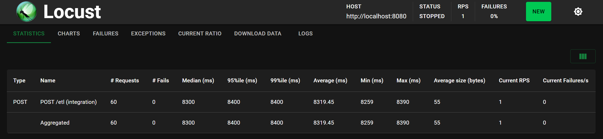
</br>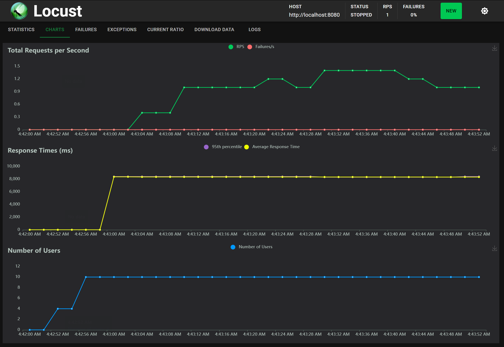

**u=50, r=5**
</br>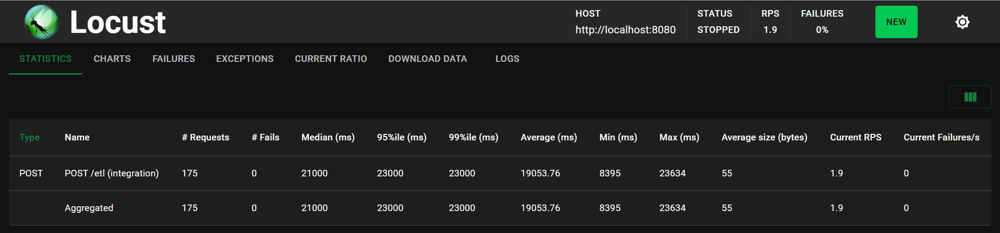
</br>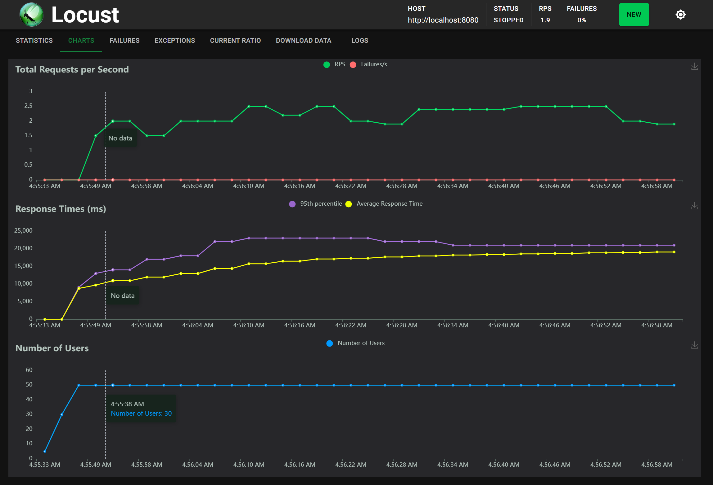

**u=100, r=10**
</br>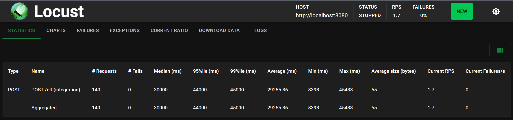
</br>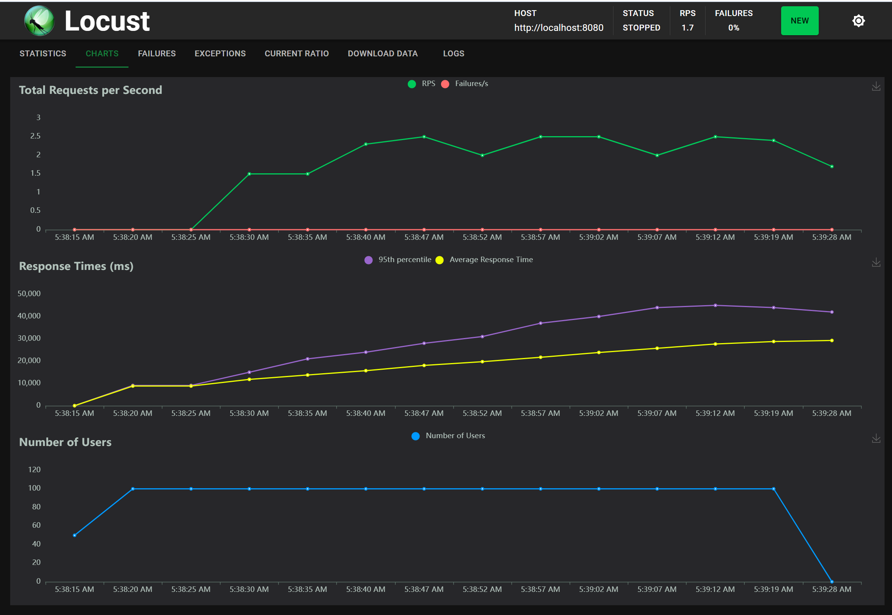

**u=200, r=20**
*(pending — re-run with `--html docs/reports/exp1_w1_u200.html` to capture)*

---

### W = 2 workers

**u=10, r=2**
</br>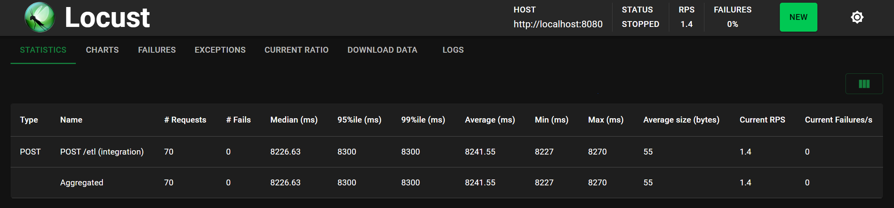
</br>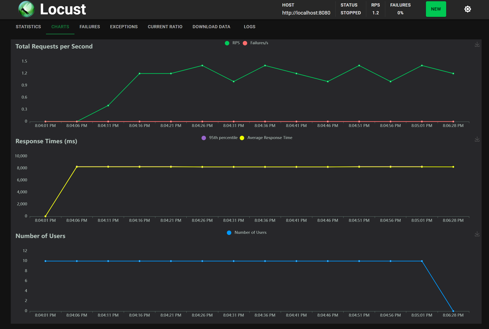

**u=50, r=5**
</br>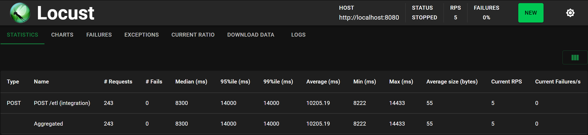
</br>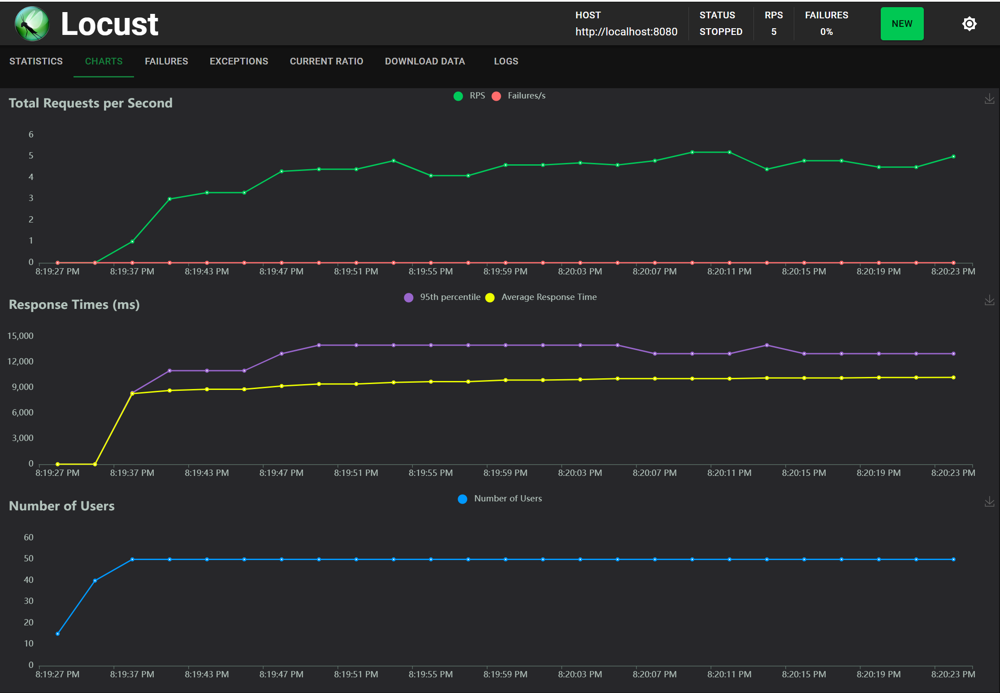

**u=100, r=10**
</br>
</br>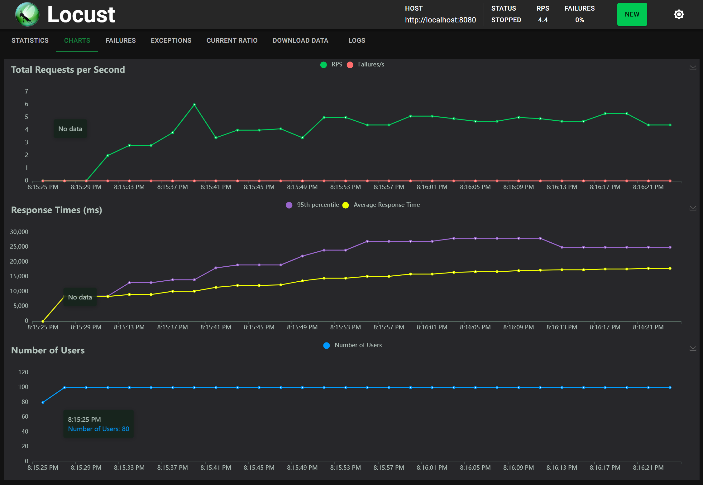

**u=200, r=20**
</br>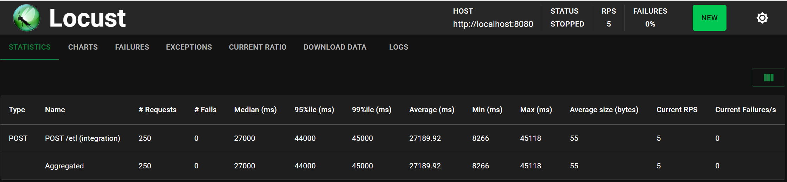
</br>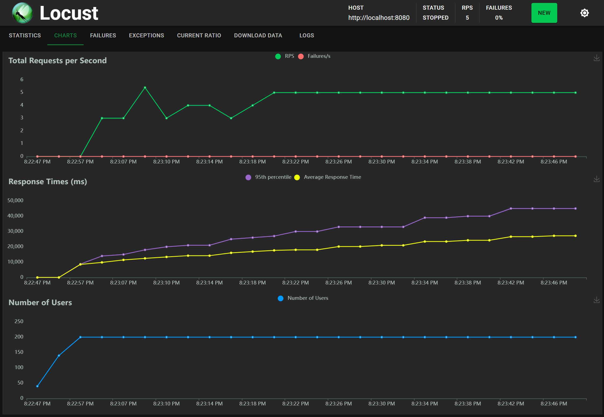

---

### W = 4 workers

**u=10, r=2**
</br>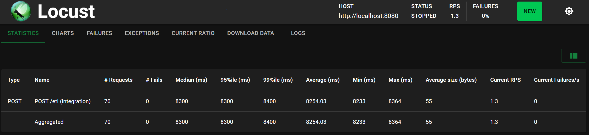
</br>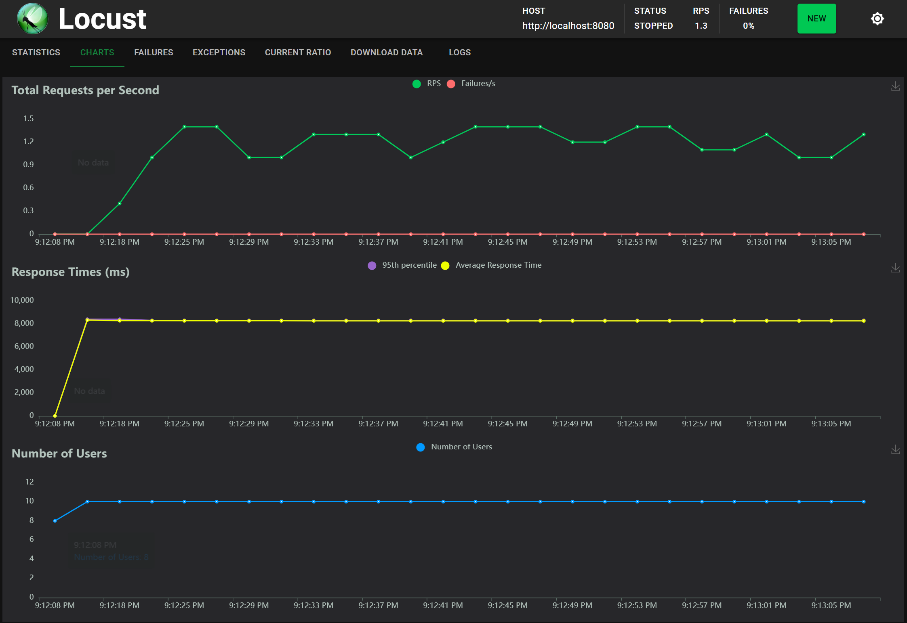

**u=50, r=5**
</br>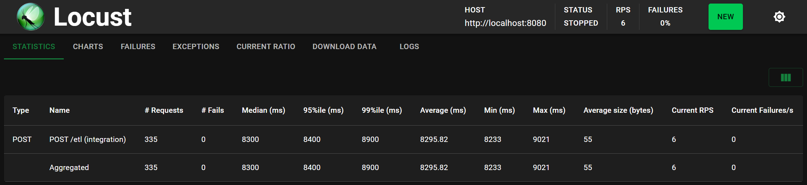
</br>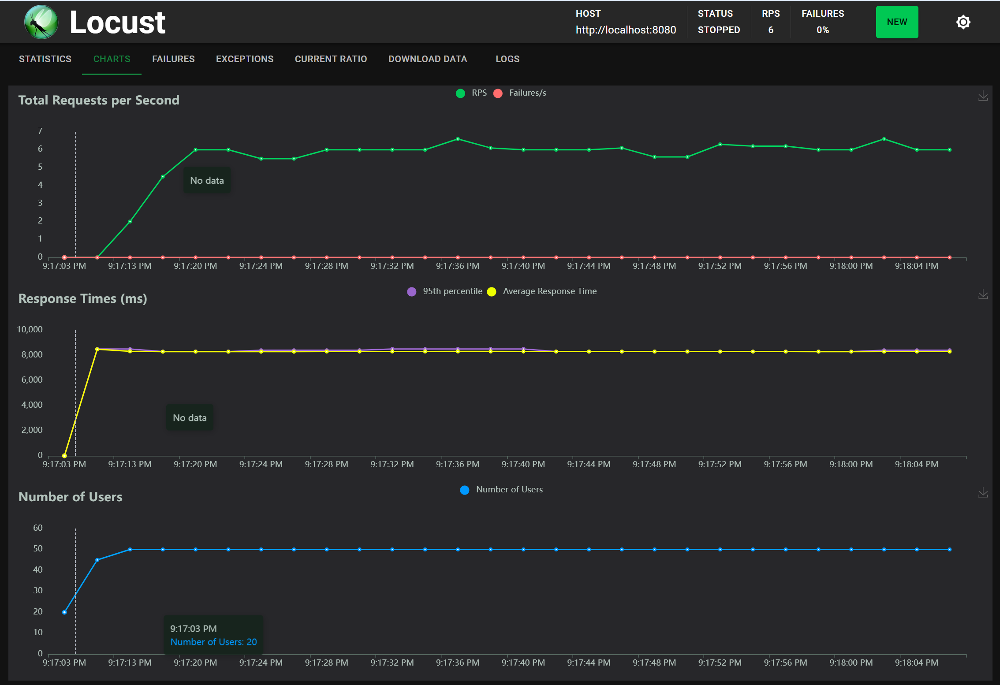

**u=100, r=10**
</br>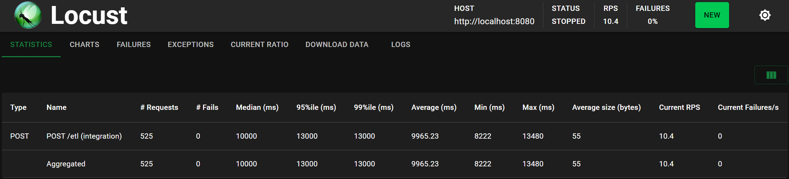
</br>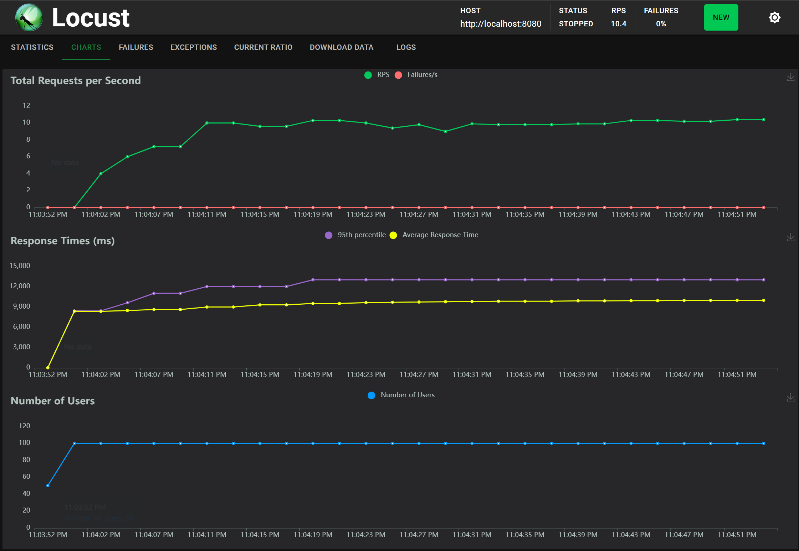

**u=200, r=20**
</br>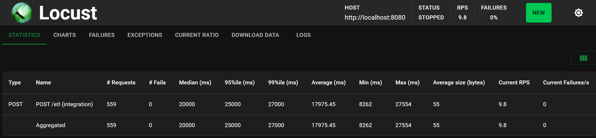
</br>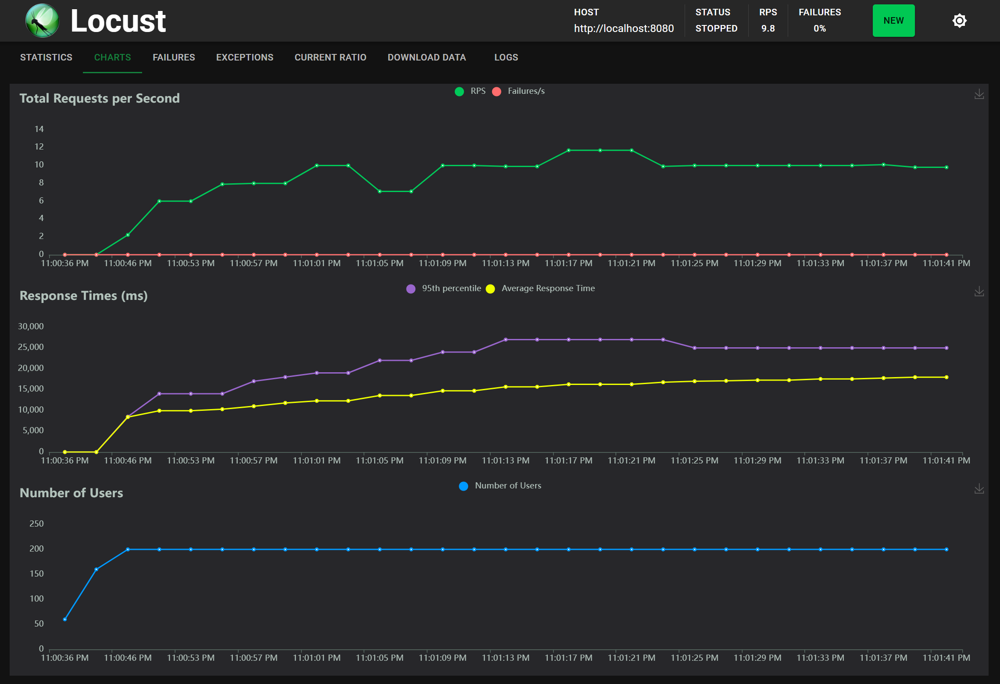
