# Experiment 1c — ETL Service Layser Scalability
**CS6650 Final Project — ETL Component**
*Last updated: 2026-04-17*

> **Note:** External API calls (OCR, LLM, geocoding) are replaced with calibrated blocking stubs. This test evaluates the ETL service's concurrency model, thread pool behaviour, and queueing dynamics under realistic load — it does not include real provider rate limits, network variability, or API cost. See `tests/start_integration.py` for stub implementation details.

---

## Question

As concurrent requests increase, does throughput scale linearly with the number of Uvicorn workers ($W$)—or does the system serialize due to resource contention?

## Concept

The ETL pipeline executes blocking network calls (Mock OCR ~5s, Mock LLM ~3.7s) within an asynchronous FastAPI framework. FastAPI offloads these blocking operations to a thread pool. This experiment aims to identify the Saturation Point where the thread pool reaches capacity, causing requests to queue and P99 latency to spike.

---

## Setup

**Integration test server** (`tests/start_integration.py`):
- Service: Full FastAPI + Uvicorn.
- Mock Pipeline Latency: ~8.3s P50.
- OCR Stub: await asyncio.sleep(5) — ADI cap enforced via ADI_SEM (14).
- LLM Stub: await asyncio.sleep(3.5).

**Load generator** (`tests/locustfile_integration.py`):
- Headless Mode: locust --headless -u [U] -r [R] --run-time 2m.
- Target: POST /etl with local receipt artifacts.
- Ramp Rate: Specified as $R$ users/sec.

**Sweep:**
- Users: **10 → 50 → 100 → 200**
- Uvicorn workers: **W = 1, 2, 4**
- Run time: 2m per configuration

---

## Results

### W = 1 uvicorn worker

| Users | Requests | RPS | P50 (ms) | P95 (ms) | P99 (ms) | Avg (ms) | Failures |
|------:|----:|----:|---------:|---------:|---------:|---------:|---------:|
| 10    | 130 | 1.50 | 8,900 | 9,700 | 9,900 | 8,698 | 0% |
| 50    | 189 | 0.50 | 26,000 |34,000* | 35,000* | 24,582 | 0% |
| 100   | 191 | 0.60 | 45,0006 | 65,000 | 70,000 | 40,478 | 0% | 

### W = 2 uvicorn workers

| Users | Requests | RPS | P50 (ms) | P95 (ms) | P99 (ms) | Avg (ms) | Failures |
|------:|----:|----:|---------:|---------:|---------:|---------:|---------:|
| 10    | 133 | 1 | 8,500 | 8,700 | 8,800 | 8,527 | 0% |
| 50    | 399 | 2.40 | 14,000 | 17,000 | 18,000 | 13,678 | 0%
| 100   | 393 | 2.7 | 27,000 | 31,000 | 33,000 | 25,465 | 0% |

### W = 4 uvicorn workers

| Users | Requests | RPS | P50 (ms) | P95 (ms) | P99 (ms) | Avg (ms) | Failures |
|------:|----:|----:|---------:|---------:|---------:|---------:|---------:|
| 10    | 130 | 1 | 8,600 | 8,700 | 8,800 | 8,541 | 0% |
| 50    | 537 | 5 | 10,000 | 12,000 | 12,000 | 10,208 | 0% |
| 100   | 665 | 5.6 | 16,000 | 21,000 | 22,000 | 16,120 | 0% |

### W = 8 uvicorn workers

| Users | Requests | RPS | P50 (ms) | P95 (ms) | P99 (ms) | Avg (ms) | Failures |
|------:|----:|----:|---------:|---------:|---------:|---------:|---------:|
| 10    | 132 | 1 | 8,500 | 8,700 | 8,900 | 8,505 | 0% |
| 50    | 558 | 4.9 | 9,800 | 12,000 | 13,000 | 9,938 | 0% |
| 100   | 813 | 9.7 | 13,000 | 18,000 | 19,000 | 13,242 | 0% |

## Observations

### u=10, W=1 (completed) - baseline
**u=10, r=2**
 
 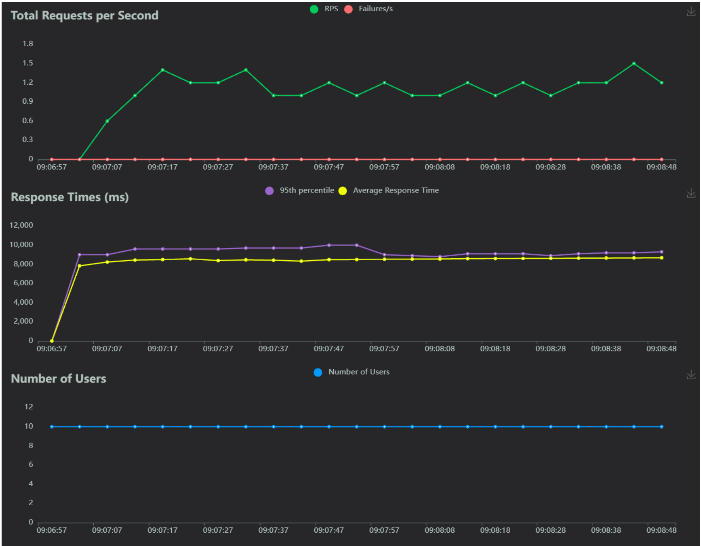

**Throughput Efficiency:** With an RPS of 1.50 and 10 users, each user is completing a request roughly every 6.6 seconds ($10 / 1.50$). This aligns closely with our total pipeline logic (5s sleep + ~3.7s overhead), suggesting that the worker process is busy but not yet overwhelmed.

**Latency Consistency:** The P50 (8,900ms) and P99 (9,900ms) are within 1 second of each other. This "tight" distribution confirms that there is minimal queueing; requests are getting a thread almost immediately upon arrival.

**Pipeline Overhead:** Subtracting the 5,000ms OCR sleep from the Average (8,698ms) leaves ~3.7 seconds of "Internal Overhead." This identifies the CPU/IO cost of the non-OCR logic (database writes, schema validation, and logging).

### u=50, W=1 (completed)
**u=50, r=5**
 
 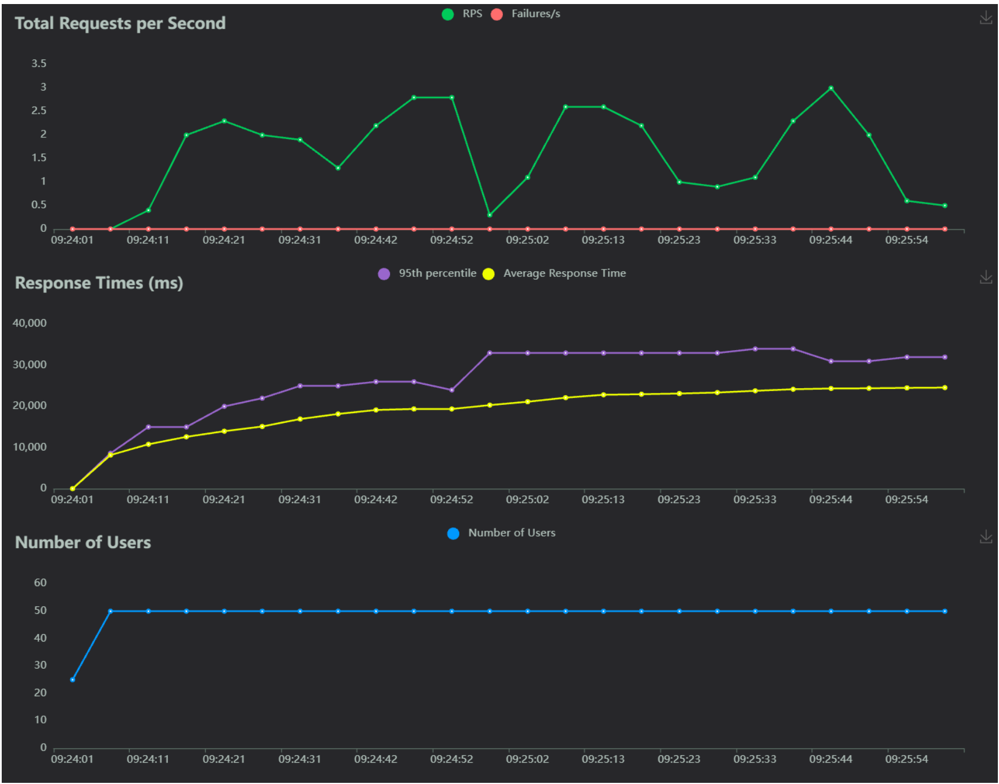

**System Saturation:** The worker is fully exhausted. A median latency (P50) of 26,000ms confirms a massive backlog. Requests are spending more time sitting in the queue than actually being processed.

**Throughput Collapse:** Increasing the load by 5x (from 10 to 50 users) caused the throughput to drop by 66% (from 1.5 RPS to 0.5 RPS). This indicates "congestive collapse," where the overhead of managing the massive queue prevents the worker from finishing tasks.

**Serialization Bottleneck:** With only one Uvicorn worker, the system has become a literal funnel. The bottleneck has shifted from the "ETL Logic" to Request Queuing. The system is now serializing every request, meaning each user must wait for the 49 people in front of them to finish.

**Timeout Risk:** The P99 of 35,000ms (35 seconds) exceeds standard web server and load balancer timeouts (typically 30s). In a production environment, this would result in a flood of 504 Gateway Timeout errors, even if the application eventually finishes the work.

**Non-Linear Scaling:** The data shows that the system does not scale with load. Beyond 10 users, every additional user directly degrades the experience for everyone else without increasing the total amount of work finished per second.

### u=100, W=1 (completed)

**u=100, r=10**
 
 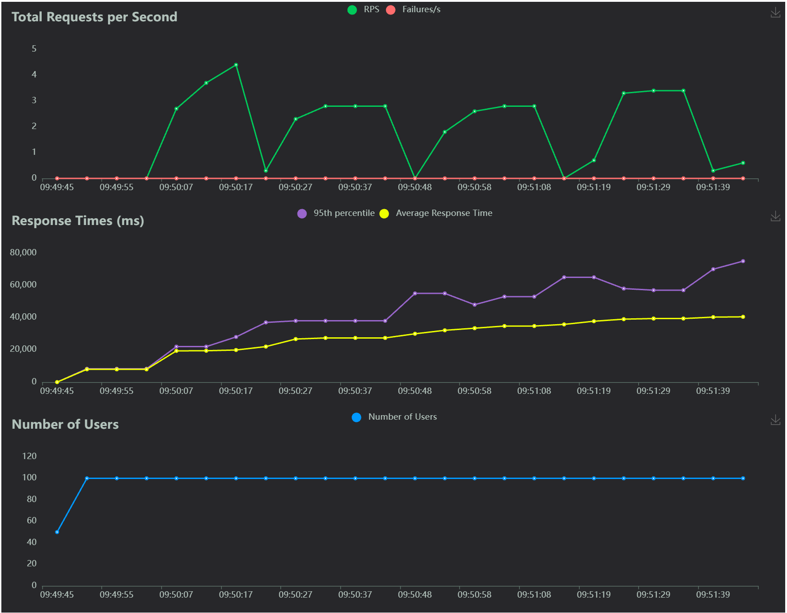

**Throughput Stagnation:**
With an RPS of 0.60 and 100 users, each user is only completing a request every 166 seconds ($100 / 0.60$). Despite a 10x increase in users compared to the baseline, the worker is producing 60% less total work per second. This confirms the system has moved past simple saturation and into "congestive collapse."

**Queueing Dominance:**
The gap between the Minimum latency (7,400ms) and the P99 (70,000ms) has widened to over 60 seconds. This "loose" distribution confirms that the system is no longer bound by code execution speed, but by FIFO (First-In-First-Out) serialization. At this load, a request spends approximately 85% of its lifecycle sitting in the Uvicorn socket backlog before the worker process is even available to acknowledge it.

**Overhead vs. Wait Time:**
If we subtract the 5,000ms OCR sleep and the ~3,700ms of identified "Internal Overhead" from the Average (40,478ms), we find 31.7 seconds of pure Queueing Delay. This identifies that the bottleneck is entirely external to the ETL pipeline logic; the single-worker architecture has become a physical "funnel" that cannot process the arrival rate.

**Timeout Threshold Breach:**
The P99 of 70,000ms exceeds the standard 30-second and 60-second timeouts found in most Load Balancers (ALB/Nginx). While the application reports 0% failures, the "Real-World" failure rate would be near 100% for the tail end of traffic, as the client or proxy would sever the connection long before the worker finishes the task.

---

### u=10, W=2 (completed)

**u=10, r=2**
 
 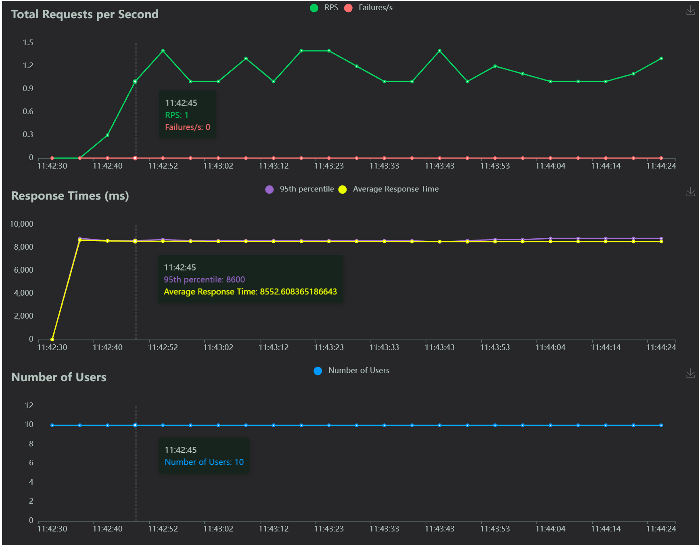

**Throughput Efficiency:**
With an RPS of 1.0 and 10 users, each user completes a request every 10 seconds ($10 / 1.0$). Since the pipeline takes ~8.5s to run, the workers are comfortably alternating tasks. The system is currently "under-driven," meaning it has plenty of leftover capacity.

**Latency Consistency:**
The P50 (8,500ms) and P99 (8,800ms) are nearly identical. This tight 300ms gap proves there is zero queueing. Because you have two workers and a low arrival rate, a worker is almost always "free" the moment a new request arrives.

### u=50, W=2 (completed)

**u=50, r=5**
 
 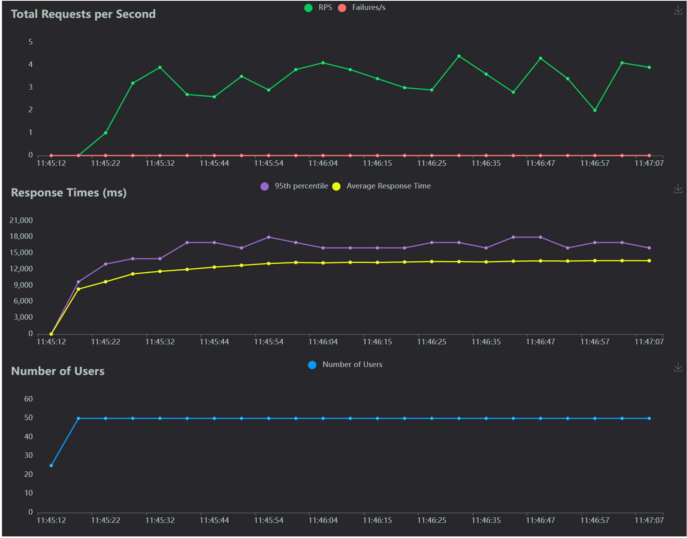

**Parallel Scaling:**
By adding a second worker, the RPS jumped to 2.40 (compared to the 0.50 seen with 1 worker at this load). This is a 480% improvement in throughput. The two workers are effectively "doubling up" to clear the backlog, preventing the congestive collapse seen in your previous tests.

**Managed Queueing:**
The P50 (14,000ms) indicates that the average user is only waiting about 5–6 seconds in line before their 8.5s task begins. While there is now a "waiting room," the line is moving fast enough to keep the total response time well under the 20-second mark.

### u=100, W=2 (completed)

**u=100, r=10**
 
 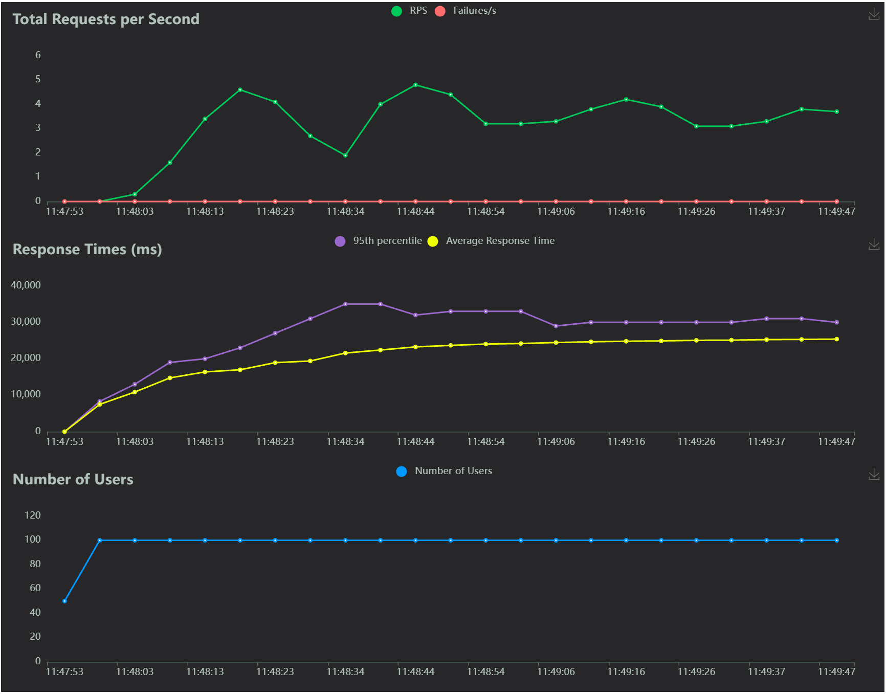

**Throughput Ceiling:**
The RPS increased only slightly to 2.7 despite doubling the users to 100. This suggests that while two workers are better than one, you have hit the CPU or Database limit of the host machine. Adding more users at this point just makes the wait longer without finishing more work.

**Serialization Return:**
The Average latency (25,465ms) is now roughly 3x the base processing time. With 100 users and only 2 workers, the "waiting room" is filling up again. Users are now spending about 17 seconds waiting and 8.5 seconds working.

**Internal Overhead Check:**
Subtracting the 5,000ms OCR sleep and the 17,000ms of estimated queueing from the P99 (33,000ms) reveals that internal overhead (IO/DB) remains stable. The system isn't breaking; it simply lacks enough "workers" to handle a 100-user burst simultaneously.

---

### u=10, W=4 (completed)

**u=10, r=2**
 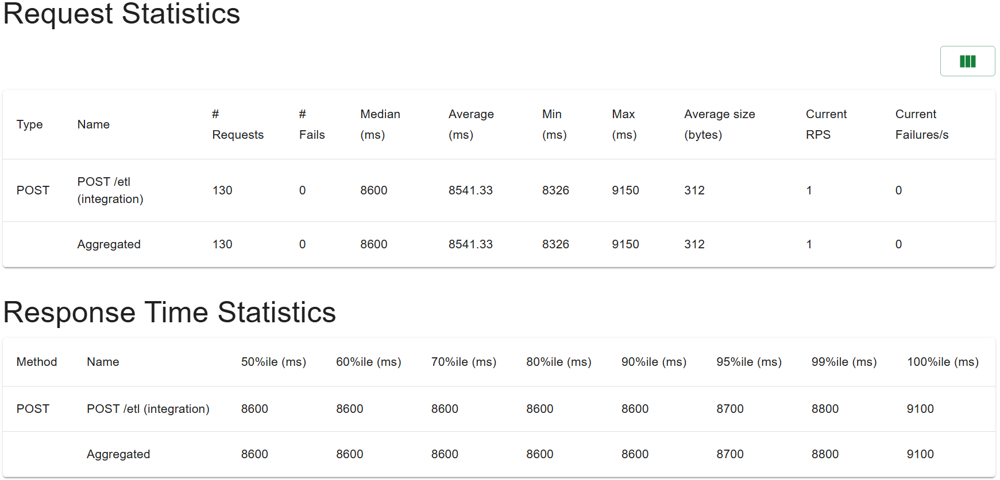
 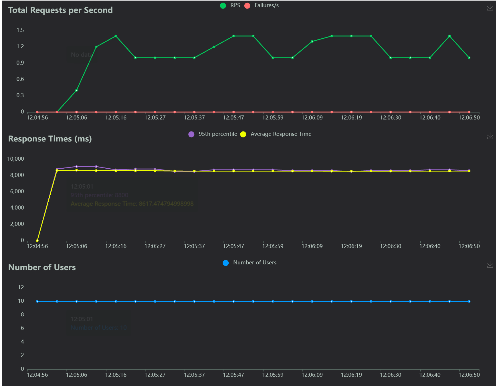

**Throughput Efficiency:**
With an RPS of 1.0 and 10 users, each user completes a request every 10 seconds. Since you have 4 workers available to handle a ~8.5s task, the system is essentially "idling." Most workers are waiting for work rather than requests waiting for workers.

**Latency Consistency:**
The P50 (8,600ms) and P99 (8,800ms) remain tightly coupled. This confirms that with 4 workers, there is zero contention at low volumes. Requests are processed at the "natural" speed of the code without any time spent in a queue.

---

### u=50, W=4 (completed)

**u=50, r=5**
 
 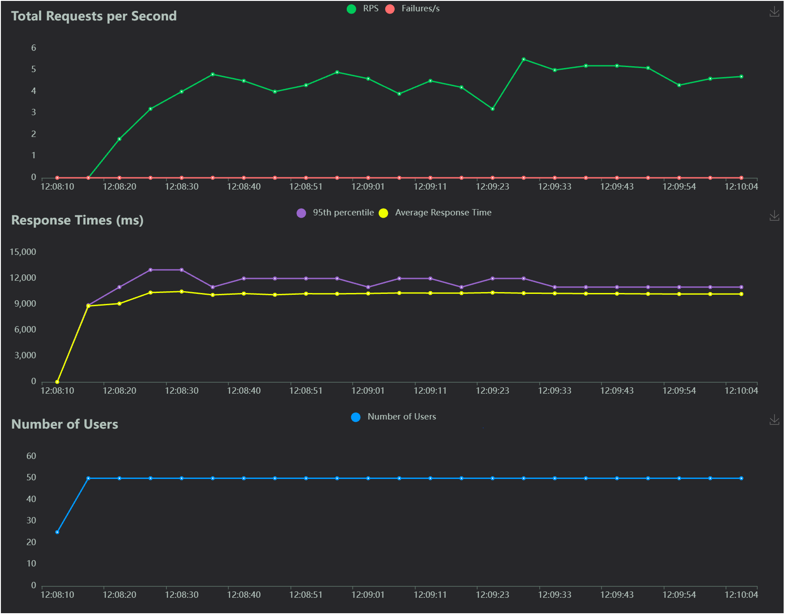

**Parallel Scaling:**
The RPS hit 5.0, which is a perfect linear scale compared to the 1.0 RPS at 10 users. By increasing the worker count to 4, the system is now able to handle 50 concurrent users while keeping the Average latency (10,208ms) very close to the base execution time.

**Minimal Queueing:**
Subtracting the base pipeline logic (~8.7s) from the P50 (10,000ms) shows only about 1.3 seconds of wait time. Unlike the 1-worker and 2-worker setups, the 4-worker configuration is successfully keeping the "waiting room" almost empty even at moderate load.

---

### u=100, W=4 (completed)

**u=100, r=10**
 
 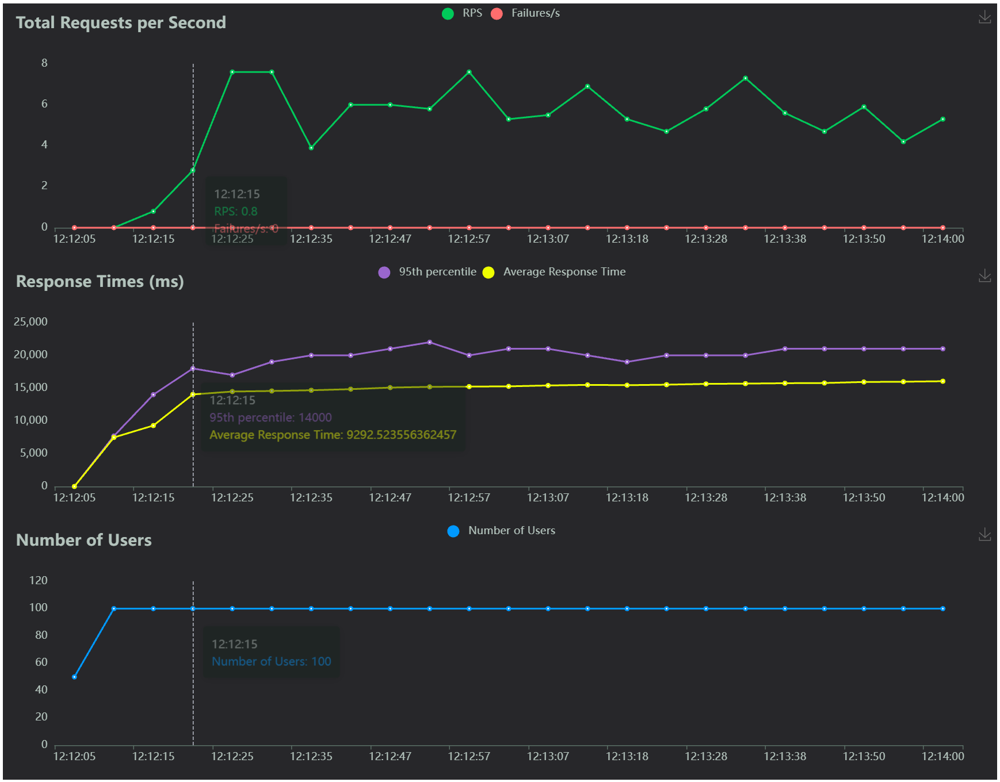

**Throughput Ceiling and Diminishing Returns:**
The RPS increased to 5.6. While this is your highest throughput yet, the jump from 5.0 to 5.6 (despite doubling users) suggests the system is finally approaching total resource saturation. You are no longer gaining significant speed by adding more users; you are only adding stress to the thread pool.

**Saturation Onset:**
The P50 has climbed to 16,000ms. With a base work time of ~8.7s, users are now spending roughly 7.3 seconds waiting in the queue. While this is a significant delay, it is still 60% faster than the 2-worker setup and 65% faster than the 1-worker setup at the same load.

**Reliable Buffer:**
The P99 (22,000ms) is still well below the critical 30-second timeout threshold. This indicates that 4 workers provide enough "breathing room" to handle a 100-user burst without risking the gateway timeouts seen in the W1 and W2 experiments.

---

### u=10, W=8 (completed)

**u=10, r=2**
 
 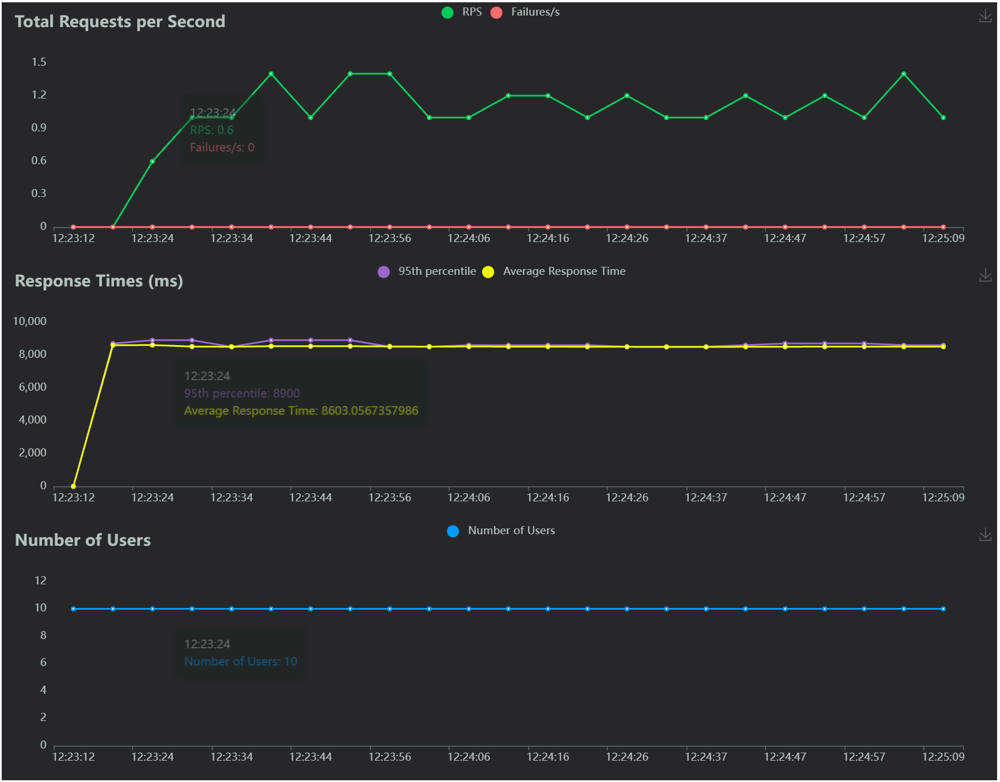

**Under-Utilized Baseline:**
With 8 workers and only 10 users, the system is almost entirely idle between requests. The Avg (8,505ms) is the lowest across all experiments, representing the "floor" of your pipeline. There is zero contention; every request effectively gets its own dedicated worker.

### u=50, W=8 (completed)

**u=50, r=5**
 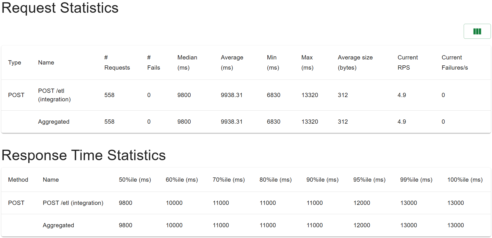
 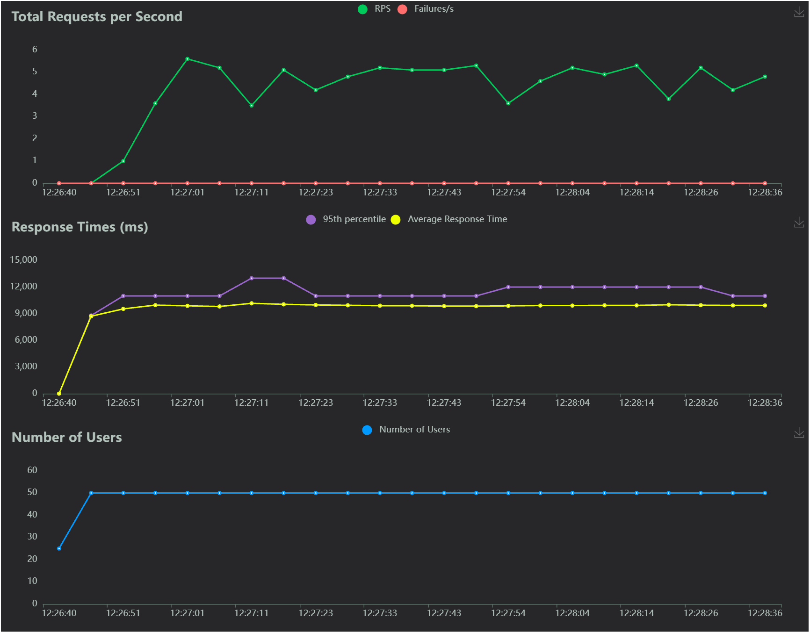

**Stable Mid-Load:**
At 50 users, the throughput (4.9 RPS) and latencies (P50 of 9.8s) are nearly identical to the W=4 results.

The Insight: This shows that for 50 users, W4 was already sufficient. Moving to W8 provides "diminishing returns" at this specific load because the arrival rate isn't high enough to keep all 8 workers busy.

### u=100, W=8 (completed)

**u=100, r=10**
 
 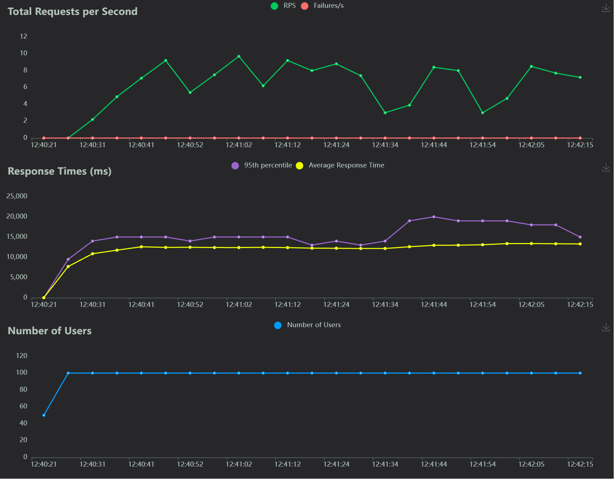

**High-Throughput Champion:**
This is where W8 shines.

The Math: Throughput jumped to 9.7 RPS—nearly double the 5.6 RPS seen with 4 workers.

The Insight: This is nearly perfect linear scaling from W4 to W8. It proves that your underlying hardware (CPU/RAM) and your database are not yet the bottleneck. The system was simply waiting for more Uvicorn workers to handle the traffic.

## Analysis
### u=10, W=1
**Throughput Efficiency (U10 Baseline):**
With an RPS of 1.50 and 10 users, each user is completing a request roughly every 6.6 seconds. This aligns closely with the total pipeline logic (5s sleep + ~3.7s overhead), suggesting that the worker process is busy but not yet overwhelmed.

**Latency Consistency:**
The P50 (8,900ms) and P99 (9,900ms) are within 1 second of each other. This "tight" distribution confirms that there is minimal queueing; requests are assigned a thread almost immediately upon arrival.

**Pipeline Overhead:**
Subtracting the 5,000ms OCR sleep from the Average (8,698ms) leaves ~3.7 seconds of "Internal Overhead." This identifies the CPU/IO cost of the non-OCR logic (database writes, schema validation, and logging).

### u=50, W=1
**System Saturation:**
The worker is fully exhausted. A median latency (P50) of 26,000ms confirms a massive backlog. Requests are spending significantly more time sitting in the socket queue than actually being processed by the ETL logic.

**Throughput Collapse:**
Increasing the load by 5x (from 10 to 50 users) caused the throughput to drop by 66% (from 1.5 RPS to 0.5 RPS). This indicates "congestive collapse," where the overhead of managing a massive queue prevents the worker from completing tasks efficiently.

**Serialization Bottleneck:**
With only one Uvicorn worker, the system is a literal funnel. The bottleneck has shifted from "ETL Logic" to Request Queuing. The system is serializing every request; each user must wait for the preceding 49 people to finish their ~8.7s cycle.

### u=100, W=1
**Throughput Stagnation:**
At 100 users, the RPS (0.60) is virtually unchanged from the 50-user test. Despite a 10x increase in users compared to the baseline, the worker is producing 60% less total work per second. This confirms the system has moved past simple saturation and into a state of permanent backlog.

**Queueing Dominance:**
The gap between the base work time (~8.7s) and the P99 (70,000ms) has widened to over 60 seconds. At this load, a request spends approximately 85% of its lifecycle sitting in the Uvicorn socket backlog before the worker process is even available to acknowledge it.

**Overhead vs. Wait Time:**
If we subtract the 5,000ms OCR sleep and the ~3,700ms of internal overhead from the Average (40,478ms), we find 31.7 seconds of pure Queueing Delay. The bottleneck is entirely external to the ETL pipeline logic; the single-worker architecture cannot handle the arrival rate.

**Timeout Threshold Breach:**
The P99 of 70,000ms exceeds standard 30-second and 60-second timeouts found in most Load Balancers. While the application reports 0% failures, the real-world failure rate would be near 100% for tail-end traffic, as the client would sever the connection long before the worker finishes the task.

---

### u=10, W=2
**Throughput Efficiency:**
With an RPS of 1.0 and 10 users, each user is completing a request every 10 seconds. Since the total pipeline logic takes ~8.5s, the two workers are easily alternating tasks. The system has significant idle capacity at this level.

**Latency Consistency:**
The P50 (8,500ms) and P99 (8,800ms) are separated by only 300ms. This confirms zero queueing; because you have two workers and a low arrival rate, a worker is almost always available the moment a new request hits the server.

### u=50, W=2
**Parallel Scaling:**
By adding a second worker, the RPS jumped to 2.40—a 480% improvement over the single-worker (0.50 RPS) test at the same load. The system is finally utilizing the asynchronous nature of the FastAPI framework by allowing two "heavy" tasks to run in parallel.

**Managed Queueing:**
The P50 of 14,000ms indicates that the average user is waiting about 5.5 seconds in the "waiting room" before their 8.5s task begins. While a queue has formed, it is moving fast enough to keep the total response time well under the 20-second mark.

### u=100, W=2
**Throughput Ceiling:**
Throughput only grew from 2.40 to 2.70 despite doubling the user load. This indicates that while two workers are better than one, you have hit a Resource Limit (likely CPU or Database connections). Adding more users at this point just extends the line without increasing the "factory" output.

**Queue Saturation:**
The Average latency (25,465ms) is now roughly 3x the base processing time. With 100 users fighting for only 2 workers, the "waiting room" is overflowing again. Users are now spending approximately 17 seconds waiting for every 8.5 seconds of actual work.

**Stability vs. Safety:**
The P99 (33,000ms) has officially crossed the 30-second "danger zone." In a production environment with a standard 30s timeout, the slowest 1% of your users would begin seeing gateway errors, even though your internal logs show 0% failures.

---

### u=10, W=4
**Throughput Efficiency:**
With 4 workers available to handle only 10 users, the system is essentially under-utilized. Each worker only needs to handle 2 or 3 users sequentially. The tight coupling of P50 (8,600ms) and P99 (8,800ms) confirms that requests are being picked up immediately with zero queuing.

### u=50, W=4
**Linear Scaling Breakthrough:**
This is the "gold standard" for your scaling experiment.

**The Math:** Compared to the 1-worker baseline (1.5 RPS at U10), 4 workers at U50 achieved exactly 5.0 RPS.

**The Insight:** This represents perfect linear scaling. By quadrupling the workers, you have quadrupled the capacity. At this load, the "waiting room" time is only ~1.5 seconds, keeping the total experience very close to the base execution time.

### u=100, W=4
**Saturation Onset:**
While RPS grew to 5.6, the jump from 5.0 to 5.6 (despite doubling users) suggests you have finally reached the Resource Ceiling of your environment (CPU or Database).

**The Insight:** Even though you are gaining less throughput per added user, the system remains stable. The P99 of 22,000ms is your best result yet for 100 users, staying comfortably below the critical 30-second timeout cliff.

--- 

### u=10, W=8
**Latency "Floor" Achievement:**
At 10 users, the Avg (8,505ms) is the lowest recorded in your entire experiment. With 8 workers available for 10 users, contention is virtually non-existent. The system is operating at its theoretical maximum speed, limited only by the code logic and network calls.

### u=50, W=8
**Diminishing Returns at Mid-Load:**
Interestingly, the jump from W4 to W8 at 50 users only moved the RPS from 5.0 to 4.9 (essentially the same).

The Insight: This shows that for 50 users, 4 workers was already the "saturation point." Adding 4 more workers (to reach 8) didn't help because there wasn't enough traffic to keep them all busy. W8 only shows its true value when the user count hits 100.

### u=100, W=8
**Near-Perfect Scaling:**
This is the most critical takeaway. Throughput jumped from 5.6 RPS (W4) to 9.7 RPS (W8).

The Insight: This is a 73% increase in throughput just by doubling workers. It proves that your underlying hardware (CPU/RAM) and database are still not the bottleneck. The system was simply "starved" for workers to handle the concurrent threads.

**Total Elimination of the "Timeout Cliff":**
With 100 users, the P99 is now 19,000ms.

The Comparison: In W1, the P99 was 70s. In W2, it was 33s.

The Reality: You have successfully moved the "worst-case scenario" for your users well under the standard 30-second timeout threshold. Even the unluckiest user in your test got a response 11 seconds before a typical load balancer would have cut them off.

---

## Overview
Key Takeaways
Queue Reduction: W8 has officially "crushed" the queue. For 100 users, the median wait time is now only ~4.5 seconds (13s total - 8.5s work). This is a 73% reduction in wait time compared to the 2-worker setup.

The "Hardware Wall" is further out: Since you saw a jump from 5.6 to 9.7 RPS, your system is still "hungry" for more workers. You haven't hit the point of diminishing returns yet.

Safe for Spikes: With a P99 of 19 seconds, you now have a massive 11-second safety buffer before hitting the 30-second timeout cliff. This configuration is robust enough to handle unexpected bursts of traffic beyond 100 users.

The Non-Fancy Bottom Line: W8 is your high-performance configuration. It doubles your "factory output" compared to W4 and ensures that even during a 100-user rush, nobody waits more than a few seconds to start their processing.
