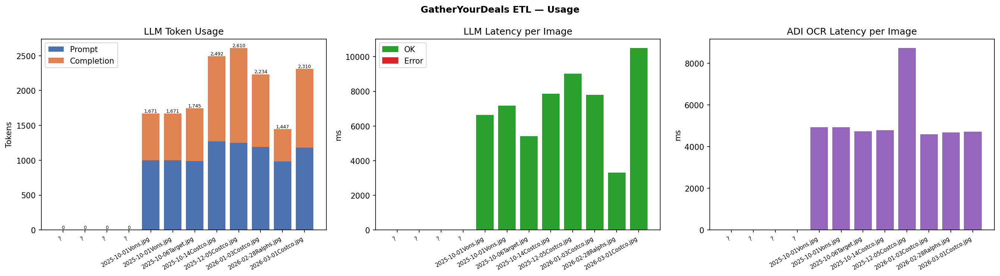

# GatherYourDeals ETL Report
_Generated: 2026-03-25 12:39 UTC_

## Cost & Token Summary

| Metric | Value |
|--------|-------|
| ADI OCR calls | 13 (13 pages) |
| ADI estimated cost | $0.0000 USD |
| ADI avg latency | 3760 ms |
| LLM calls | 12 (8 success) |
| LLM total tokens | 16,180 |
| LLM input / output | 8,855 / 7,325 |
| LLM estimated cost | $0.000000 USD |
| LLM avg latency | 4812 ms |
| **Total estimated cost** | **$0.000000 USD** |
| Items extracted | 96 |
| Items uploaded | 0 |

## Per-Image Breakdown

| Image | ADI (ms) | ADI cost | LLM provider | LLM model | Input | Output | LLM cost | LLM (ms) | Items | OK |
|-------|--------:|---------:|--------------|-----------|------:|-------:|---------:|---------:|------:|:--:|
| ? | 0 | $0.0000 | ? | ? | 0 | 0 | $0.000000 | 0 | 0 | ✗ |
| ? | 0 | $0.0000 | ? | ? | 0 | 0 | $0.000000 | 0 | 0 | ✗ |
| ? | 0 | $0.0000 | ? | ? | 0 | 0 | $0.000000 | 0 | 0 | ✗ |
| ? | 0 | $0.0000 | ? | ? | 0 | 0 | $0.000000 | 0 | 0 | ✗ |
| 2025-10-01Vons.jpg | 4936 | $0.0000 | openrouter | anthropic/claude-3-haiku | 997 | 674 | $0.000000 | 6630 | 7 | ✓ |
| 2025-10-01Vons.jpg | 4936 | $0.0000 | openrouter | anthropic/claude-3-haiku | 997 | 674 | $0.000000 | 7182 | 7 | ✓ |
| 2025-10-06Target.jpg | 4737 | $0.0000 | openrouter | anthropic/claude-3-haiku | 988 | 757 | $0.000000 | 5423 | 9 | ✓ |
| 2025-10-14Costco.jpg | 4784 | $0.0000 | openrouter | anthropic/claude-3-haiku | 1,269 | 1,223 | $0.000000 | 7857 | 17 | ✓ |
| 2025-12-05Costco.jpg | 8724 | $0.0000 | openrouter | anthropic/claude-3-haiku | 1,249 | 1,361 | $0.000000 | 9029 | 21 | ✓ |
| 2026-01-03Costco.jpg | 4592 | $0.0000 | openrouter | anthropic/claude-3-haiku | 1,192 | 1,042 | $0.000000 | 7801 | 15 | ✓ |
| 2026-02-28Ralphs.jpg | 4687 | $0.0000 | openrouter | anthropic/claude-3-haiku | 981 | 466 | $0.000000 | 3323 | 4 | ✓ |
| 2026-03-01Costco.jpg | 4719 | $0.0000 | openrouter | anthropic/claude-3-haiku | 1,182 | 1,128 | $0.000000 | 10498 | 16 | ✓ |

