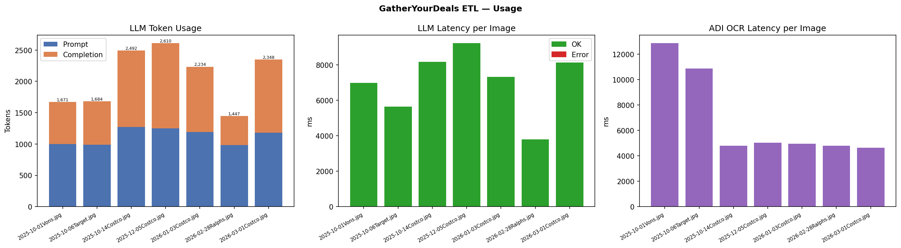

# GatherYourDeals ETL Report
_Generated: 2026-03-25 12:48 UTC_

## Cost & Token Summary

| Metric | Value |
|--------|-------|
| ADI OCR calls | 7 (7 pages) |
| ADI estimated cost | $0.0000 USD |
| ADI avg latency | 6854 ms |
| LLM calls | 7 (7 success) |
| LLM total tokens | 14,486 |
| LLM input / output | 7,858 / 6,628 |
| LLM estimated cost | $0.000000 USD |
| LLM avg latency | 7045 ms |
| **Total estimated cost** | **$0.000000 USD** |
| Items extracted | 89 |
| Items uploaded | 0 |

## Per-Image Breakdown

| Image | ADI (ms) | ADI cost | LLM provider | LLM model | Input | Output | LLM cost | LLM (ms) | Items | OK |
|-------|--------:|---------:|--------------|-----------|------:|-------:|---------:|---------:|------:|:--:|
| 2025-10-01Vons.jpg | 12874 | $0.0000 | openrouter | anthropic/claude-3-haiku | 997 | 674 | $0.000000 | 6985 | 7 | ✓ |
| 2025-10-06Target.jpg | 10880 | $0.0000 | openrouter | anthropic/claude-3-haiku | 988 | 696 | $0.000000 | 5656 | 9 | ✓ |
| 2025-10-14Costco.jpg | 4798 | $0.0000 | openrouter | anthropic/claude-3-haiku | 1,269 | 1,223 | $0.000000 | 8183 | 17 | ✓ |
| 2025-12-05Costco.jpg | 5027 | $0.0000 | openrouter | anthropic/claude-3-haiku | 1,249 | 1,361 | $0.000000 | 9228 | 21 | ✓ |
| 2026-01-03Costco.jpg | 4954 | $0.0000 | openrouter | anthropic/claude-3-haiku | 1,192 | 1,042 | $0.000000 | 7327 | 15 | ✓ |
| 2026-02-28Ralphs.jpg | 4804 | $0.0000 | openrouter | anthropic/claude-3-haiku | 981 | 466 | $0.000000 | 3806 | 4 | ✓ |
| 2026-03-01Costco.jpg | 4637 | $0.0000 | openrouter | anthropic/claude-3-haiku | 1,182 | 1,166 | $0.000000 | 8131 | 16 | ✓ |

